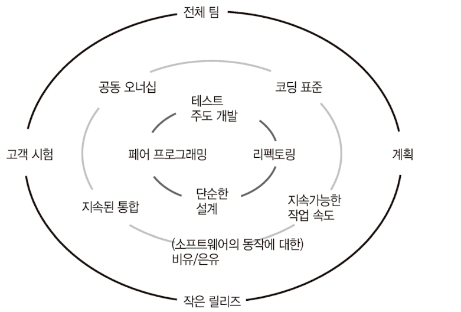

# 소프트웨어 장인 - 산드로 만쿠소

### 7장: 기술적 실행 관례

- 기술적 실행 관례를 도입하는 것이 어떤 비즈니스적 가치를 갖고 있는지 어떻게 증명할까
    - 프로젝트 관리자나 제품 오너에게 왜 이것들이 필요한지 가치를 전달해보자.
- 항상 모든 상황에서 실행 관례들을 도입할 수 있을 거라고는 믿지 않는다. 각자의 사정이 있으니까. 그래도 우리는 우리가 어떤 상황에 놓여 있는지 파악해야 한다.
- XP 실행 관례들은 소프트웨어의 품질과 일이 적절하게 제대로 수행되고 있는지에 대한 관점에서 피드백 루프를 단축시킬 수 있는 여러 방법들을 제공한다.
    - 물론 착각하지 말아야 할 것이 또 하나 있다면 실행 관례를 도입한다고 해서 안되던 일이 막 돌아가는 것이 아니다.
    - 본질적으로 이것이 어떤 것을 위함인가를 깨닫고 몸에 배인 습관처럼 반복했을 때 의도하지 않아도 자연스럽게 나오게 된다.
- 그리고 가장 중요한 것 하나는 실행 관례가 효율적이려면 반드시 모든 팀 구성원들에 의해서 그 가치가 납득되어야 한다.
    - 예를 들어 모든 팀 구성원들은 원활한 정보 소통, 빠른 피드백, 빠른 결과물 생성, 실수 예방, 고객 만족, 최선을 다하지 못하거나 배우지 못하는 것에 대한 부끄러움을 느낄 줄 아는 것, 이런 것들에 가치를 느꺼ㅕ야 한다.
    - 그리고 그것을 증명하는 것은 행동이다. 그리고 이를 증명하기 위한 행동은 기술을 파는 것이 아니다.
    - 현재의 방식과 비교해 얻을 수 있는 이익들을 제시해야 한다.
- 아래는 XP실행 관례다.
    
    

    
    - 이 중 리팩토링에 관한 사실 하나가 있다. 몇 년 동안 바뀐적이 없는 부분을 리팩토링하는 것은 의미가 없다. 애당초 코드를 수정할 필요가 없다면, 리팩토링해야 할 이유도 없다. 리팩토링은 더 자주 변경되는 부분을 대상으로 시작해야 한다.
    - 보이스카웃 규칙(처음 왔을 때보다 더 깨끗하게 하고 떠나라)은 모든 것이 아니라 해당 부분을 이해하여 변경할 필요가 있을 때 적용해야 한다.
- 실용주의는 소프트웨어 장인이 가져야 하는 최선의 역량 중 하나다. 누군가가 이야기했기 떄문에, 또는 그 실행 관례 도입을 위한 도입을 해서는 안된다.
    - 우리는 지속적으로 일하는 더나은 방법을 찾고 고객을 만족시켜야 한다.
- 무언가를 절대적인 진리로 바라보지 마라. 항상 우리가 무엇을 하고 있고 왜 하고 있는지를 질문해야 한다.